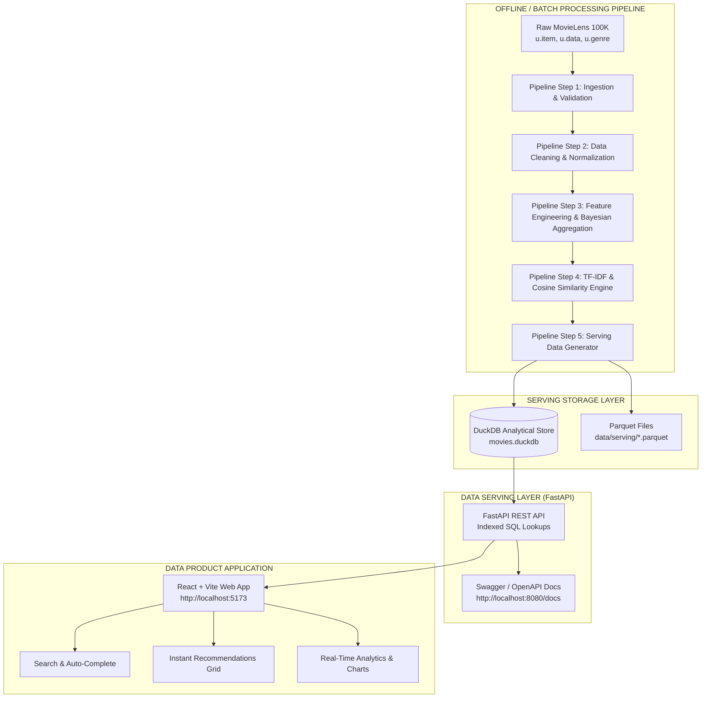

# Movie Recommendation System Using Data Serving

[](https://fastapi.tiangolo.com)
[](https://duckdb.org)
[](https://react.dev)
[](https://python.org)
[](LICENSE)

A complete, production-grade practical project for the Data Engineering curriculum topic:  
**"Serving Data for Analytics & ML"**

Demonstrating the separation of **Offline Batch Processing** (ingestion, cleaning, TF-IDF vectorization, Bayesian shrinkage) and **Low-Latency Online Data Serving** (DuckDB analytical store, FastAPI, and a modern React Data Product UI).

---

## 1. Problem Statement
In traditional machine learning and analytics workflows, models and queries are executed on the fly or embedded directly inside notebooks. However, in production web applications:
- Computing pairwise cosine similarity across thousands of movies on every HTTP request causes quadratic computational overhead ($O(N^2)$), leading to request timeouts and server bottlenecks.
- Directly querying raw CSV files lacks indexing, causing full table scans.
- Applications require sub-10 millisecond response times to deliver high-quality user experiences.

## 2. Project Objective
To design and build an end-to-end Data Engineering pipeline and Data Serving Layer that:
1. Ingests and cleans the canonical **MovieLens 100K** dataset.
2. Precomputes content-based recommendations and Bayesian popularity rankings during offline batch processing.
3. Materializes the results into an embedded columnar **DuckDB** serving store and **Parquet** files.
4. Serves application-ready data products via a high-performance **FastAPI** REST API.
5. Provides an interactive, modern **React** frontend for real-time recommendation exploration.

---

## 3. End-to-End Architecture



---

## 4. Key Academic Concepts Demonstrated

### A. Separation of Data Processing and Data Serving
Instead of forcing the API to compute similarity matrices or parse raw CSVs during incoming user requests:
- Heavy computation occurs **offline in batch**.
- The API simply serves precomputed, indexed data from **DuckDB**, yielding response latencies under **5 milliseconds**.

### B. What is a "Data Product"?
The recommendation engine is packaged as a reliable, discoverable Data Product. It provides:
- **Defined Inputs**: `movie_id` or search query string.
- **Contracted Outputs**: Ranked recommendations, cosine similarity scores, genres, and Bayesian ratings.
- **Standard Protocol**: High-throughput REST API with OpenAPI documentation.

### C. Bayesian Shrinkage Popularity Formula
To avoid ranking a movie with a single 5-star review as the most popular movie in the catalog, we apply Bayesian shrinkage (IMDb formulation):
$$W = \left(\frac{v}{v + m}\right) \cdot R + \left(\frac{m}{v + m}\right) \cdot C$$
- $v$: Rating count for the movie
- $m$: Minimum vote threshold ($m = 15$)
- $R$: Average rating of the movie
- $C$: Global mean rating across all ratings in the dataset ($\approx 3.53$)

---

## 5. Technology Stack

| Layer | Technologies | Purpose |
|---|---|---|
| **Pipeline & Processing** | Python 3.10+, Pandas, NumPy | Data ingestion, validation, and feature transformation |
| **Recommendation Engine** | scikit-learn (TF-IDF, Cosine Similarity) | Content-based similarity precomputation |
| **Analytical Serving Store** | DuckDB, Apache Parquet | Embedded vectorized columnar storage with B-Tree indexes |
| **Data Serving API** | FastAPI, Uvicorn, Pydantic | High-concurrency REST API and schema validation |
| **Frontend UI** | React 18, Vite, Vanilla CSS Design System | Responsive dark-mode Data Product dashboard |
| **Testing & Quality** | pytest, httpx, Playwright | Automated unit, API integration, and E2E browser testing |

---

## 6. Project Directory Structure

```
DE-pratical/
├── backend/                  # FastAPI Data Serving Layer
│   ├── api/                  # API route handlers
│   │   ├── movies.py         # Search, pagination, movie lookups
│   │   ├── recommendations.py# Core recommendation endpoints
│   │   └── stats.py          # Analytics, popular movies, genres
│   ├── db/
│   │   └── duckdb_client.py  # Thread-safe DuckDB query manager
│   ├── models/
│   │   └── schemas.py        # Pydantic request/response models
│   ├── services/
│   │   ├── data_service.py   # Analytical DuckDB queries
│   │   └── recommendation_service.py # Recommendation serving & fallback
│   ├── config.py             # App settings and environment paths
│   └── main.py               # FastAPI entry point
│
├── frontend/                 # React + Vite Data Product Application
│   ├── src/
│   │   ├── components/       # Header, SearchBar, SelectedMovie, Cards, Charts, Modal
│   │   ├── services/api.js   # HTTP API client
│   │   ├── App.jsx           # Main React component
│   │   ├── index.css         # Dark glassmorphic design system
│   │   └── main.jsx          # React DOM entry point
│   ├── index.html
│   ├── vite.config.js
│   └── package.json
│
├── data/
│   ├── raw/ml-100k/          # Ingested MovieLens 100K files
│   ├── processed/            # Cleaned intermediate Parquet & CSV files
│   └── serving/              # DuckDB database and serving Parquet tables
│
├── pipeline/                 # Offline Batch Data Pipeline
│   ├── ingest.py             # Schema loading & boundary validation
│   ├── clean.py              # Deduplication, year extraction, genre normalization
│   ├── transform.py          # Bayesian popularity & feature_text engineering
│   ├── recommend.py          # TF-IDF vectorization & cosine similarity precomputation
│   └── build_serving_data.py # DuckDB serving table and index generation
│
├── scripts/
│   ├── download_data.py      # Automated dataset downloader
│   ├── run_pipeline.py       # Single CLI command running complete pipeline
│   └── setup.py              # Environment setup verification
│
├── tests/                    # Comprehensive Automated Test Suite
│   ├── test_pipeline.py      # Ingestion, cleaning, transformation unit tests
│   ├── test_recommendations.py # Similarity and fallback tests
│   └── test_api.py           # FastAPI REST integration tests
│
├── docs/                     # Academic Documentation
│   ├── CONCEPTS.md           # Syllabus concept explanations
│   ├── PRESENTATION_NOTES.md # Viva prep and presentation pitch
│   ├── PLAYWRIGHT_TEST_REPORT.md # Browser automated test report
│   └── screenshots/          # Real screenshots of the application
│
├── requirements.txt
├── .env.example
├── .gitignore
└── README.md
```

---

## 7. Quick Start & Execution

### Prerequisites
- Python 3.10+ installed
- Node.js 18+ and npm installed

### Step 1: Install Python Dependencies
```bash
pip install -r requirements.txt
```

### Step 2: Download Dataset & Run Data Pipeline
Execute the complete offline data pipeline with a single CLI command:
```bash
python scripts/run_pipeline.py
```
*Output Summary:*
```
============================================================
           MOVIE DATA PIPELINE COMPLETE
============================================================
Movies processed:          1,682
Ratings processed:         100,000
Total genres available:    19
Recommendations generated: 25,213
Popular movies indexed:    50
Serving tables created:    4 (movies, ratings_summary, recommendations, popular_movies)
Serving Database:          .../data/serving/movies.duckdb
Sample Query Latency:      6.74 ms
Total Pipeline Runtime:    2.06 seconds
Status:                    SUCCESS
============================================================
```

### Step 3: Start the Backend Data Serving API
```bash
python -m uvicorn backend.main:app --reload --port 8000
```
- API Base: `http://127.0.0.1:8000`
- Interactive Swagger UI: `http://127.0.0.1:8000/docs`

### Step 4: Start the Frontend Application
In a separate terminal:
```bash
cd frontend
npm install
npm run dev
```
Open `http://localhost:5173` in your browser.

---

## 8. Database Schema (DuckDB Serving Store)

The serving store is located at `data/serving/movies.duckdb`:

### `movies` Table
| Column | Type | Description |
|---|---|---|
| `movie_id` | `INTEGER PRIMARY KEY` | Unique movie identifier |
| `title` | `VARCHAR NOT NULL` | Standardized movie title |
| `genres` | `VARCHAR NOT NULL` | Pipe-delimited genre string |
| `release_year` | `INTEGER` | 4-digit extracted release year |

### `ratings_summary` Table
| Column | Type | Description |
|---|---|---|
| `movie_id` | `INTEGER PRIMARY KEY` | References `movies.movie_id` |
| `avg_rating` | `DOUBLE NOT NULL` | Mean rating (1.0 to 5.0) |
| `rating_count` | `INTEGER NOT NULL` | Total ratings received |
| `popularity_score` | `DOUBLE NOT NULL` | Bayesian shrinkage weighted score |

### `recommendations` Table
| Column | Type | Description |
|---|---|---|
| `movie_id` | `INTEGER NOT NULL` | Source movie identifier |
| `recommended_movie_id` | `INTEGER NOT NULL` | Recommended movie identifier |
| `rank` | `INTEGER NOT NULL` | Recommendation position (1 to 15) |
| `similarity_score` | `DOUBLE NOT NULL` | Cosine similarity score [0.0 - 1.0] |
| *Primary Key* | `(movie_id, rank)` | Clustered unique key |

### `popular_movies` Table
| Column | Type | Description |
|---|---|---|
| `movie_id` | `INTEGER PRIMARY KEY` | Movie identifier |
| `rank` | `INTEGER NOT NULL` | Popularity leaderboard rank |
| `popularity_score` | `DOUBLE NOT NULL` | Bayesian popularity score |

---

## 9. API Reference

All endpoints return actual observed query latencies.

| Method | Endpoint | Description |
|---|---|---|
| `GET` | `/` | Serving Layer health check and database row counts |
| `GET` | `/api/movies` | Paginated movies with genre filtering and sorting |
| `GET` | `/api/movies/search?q={query}` | Relevance-ranked movie title search |
| `GET` | `/api/movies/{id}` | Movie metadata and ratings summary |
| `GET` | `/api/movies/{id}/recommendations` | Precomputed recommendations with fallback logic |
| `GET` | `/api/movies/{id}/similar` | Content similarity breakdown for presentation |
| `GET` | `/api/popular` | Top Bayesian popular movies fallback pool |
| `GET` | `/api/stats` | Dataset statistics, genre counts, and rating distribution |
| `GET` | `/api/genres` | List of all distinct genres |
| `POST` | `/api/recommend` | Query recommendations via JSON request body |

---

## 10. Automated Testing

Run the automated test suite with pytest:
```bash
python -m pytest -v tests/
```
All **29 test cases** validate ingestion integrity, Bayesian calculations, schema contracts, similarity ranges, and API response codes.

---

## 11. Screenshots
Screenshots captured automatically during browser evaluation are located in `docs/screenshots/`:
- `01_homepage.png`: Main dashboard with KPI metrics and live backend health indicator.
- `02_search_results.png`: Instant autocomplete dropdown while searching for "Star Wars".
- `03_recommendations_spotlight.png`: Active target movie spotlight and recommended cards.
- `04_analytics_charts.png`: Rating distribution histogram and genre catalog breakdown.

---

## 12. Academic Relevance & Presentation Demo Flow
For a live college presentation or viva evaluation:
1. Explain the **Problem**: ML model inference cannot run inside HTTP request handlers.
2. Run `python scripts/run_pipeline.py` to demonstrate the batch pipeline execution (~2 seconds).
3. Open `http://127.0.0.1:8080/docs` to demonstrate the FastAPI Swagger Data Product.
4. Open `http://localhost:5173` to demonstrate searching for *"Star Wars"*, showing that recommendations appear in **< 5 milliseconds** directly from DuckDB serving tables.
5. Refer to `docs/CONCEPTS.md` and `docs/PRESENTATION_NOTES.md` for in-depth answers to 15+ likely viva questions.
